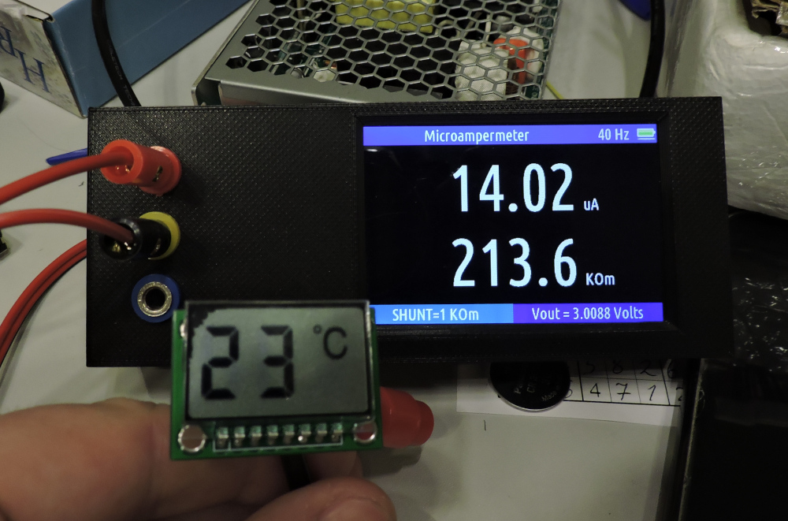

# Микроамперметр

Микроамперметр перфекциониста, с возможностью посмотреть график и гистограмму получаемого тока.
Предназначен для того, что-бы отлаживать низкопотребляющие железки,
которые во сне потребляют микроамперы, а когда проснулись, то могут потреблять десятки миллиампер.

* [Видео с возможностями прибора.](https://www.youtube.com/watch?v=IdX-KkagfNQ)

